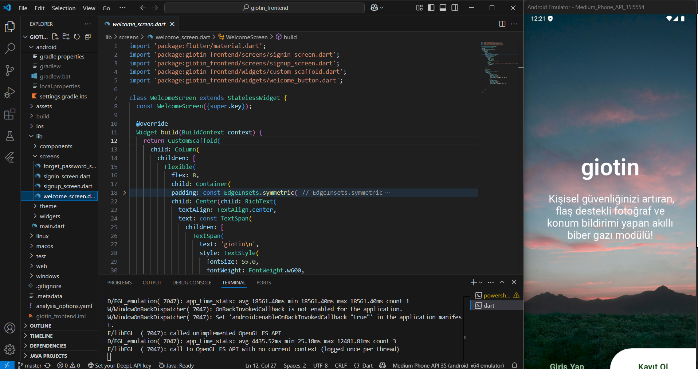

# 📱 Flutter Project Name

This project is a simple and useful mobile application developed using Flutter. 

## 📸 App Screenshot



## 🚀 Project Features

- Simple and intuitive Flutter UI
- Fast and performant
- Android and iOS support

## 🛠️ Installation and Running

Follow the steps below to run the project smoothly on your phone or emulator:

### 📥 Step 1: Download the Project

Open your terminal and run the following commands:

```bash
git clone https://github.com/username/project-name.git
cd project-name
```

### 📦 Step 2: Install Dependencies

Install the required Flutter packages:

```bash
flutter pub get
```

### 📱 Step 3: Prepare a Device or Emulator

- **Using a Real Device:**
  1. Enable developer mode on your phone.
  2. Activate USB debugging.
  3. Connect your phone to your computer via USB.

- **Using an Emulator:**
  - Start the emulator via Android Studio or run:

```bash
flutter emulators --launch emulator_name
```

> To see available emulators: `flutter emulators`

### 🚦 Step 4: Run the Project

Run the app with the following command:

```bash
flutter run 
```

🛠️ Troubleshooting

If you encounter any issues while running the project, use the following command to diagnose and fix common problems:
```bash
flutter doctor
```
This command checks your environment and displays a report of the status of your Flutter installation.

## 📝 Usage Instructions

- When the app opens, a simple interface will be presented.
- You can update your app in any way you want

## 📄 License

MIT License © 2025 - Hüseyin Selen

